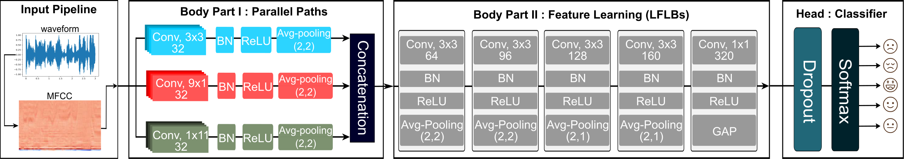

# Light-SERNet

This is the Tensorflow 2.x implementation of our paper ["Light-SERNet: A lightweight fully convolutional neural network for speech emotion recognition"](https://arxiv.org/abs/2110.03435), accepted in ICASSP 2022. 

<div align=center>

</div>
In this paper, we propose an efficient and lightweight fully convolutional neural network(FCNN) for speech emotion recognition in systems with limited hardware resources. In the proposed FCNN model, various feature maps are extracted via three parallel paths with different filter sizes. This helps deep convolution blocks to extract high-level features, while ensuring sufficient separability. The extracted features are used to classify the emotion of the input speech segment. While our model has a smaller size than that of the state-of-the-art models, it achieves a higher performance on the IEMOCAP and EMO-DB datasets.


## Demo
Demo on EMO-DB dataset: 
[](https://colab.research.google.com/github/AryaAftab/LIGHT-SERNET/blob/master/Demo_Light_SERNet.ipynb)


## Run
### 1. Clone Repository
```bash
$ git clone https://github.com/AryaAftab/LIGHT-SERNET.git
$ cd LIGHT-SERNET/
```
### 2. Requirements
- Tensorflow >= 2.3.0
- Numpy >= 1.19.2
- Tqdm >= 4.50.2
- Matplotlib> = 3.3.1
- Scikit-learn >= 0.23.2

```bash
$ pip install -r requirements.txt
```

### 3. Data:
* Download **[EMO-DB](http://emodb.bilderbar.info/download/download.zip)** and **[IEMOCAP](https://sail.usc.edu/iemocap/iemocap_release.htm)**(requires permission to access) datasets
* extract them in [data](./data) folder

**Note:** For using **IEMOCAP** dataset, please follow issue [#3](../../issues/3). 

### 4. Set hyperparameters and training config :
You only need to change the constants in the [hyperparameters.py](./hyperparameters.py) to set the hyperparameters and the training config.

### 5. Strat training:
Use the following code to train the model on the desired dataset, cost function, and input length(second).
- Note 1: The input is automatically cut or padded to the desired size and stored in the [data](./data) folder.
- Note 2: The best model are saved in the [model](./model) folder.
- Note 3: The results for the confusion matrix are saved in the [result](./result) folder.
```bash
$ python train.py -dn {dataset_name} \
                  -id {input durations} \
                  -at {audio_type} \
                  -ln {cost function name} \
                  -v {verbose for training bar} \
                  -it {type of input(mfcc, spectrogram, mel_spectrogram)} \
                  -c {type of cache(disk, ram, None)} \
                  -m {fuse mfcc feature extractor in exported tflite model}
```
#### Example:

EMO-DB Dataset:
```bash
python train.py -dn "EMO-DB" \
                -id 3 \
                -at "all" \
                -ln "focal" \
                -v 1 \
                -it "mfcc" \
                -c "disk" \
                -m false
```

IEMOCAP Dataset:
```bash
python train.py -dn "IEMOCAP" \
                -id 7 \
                -at "impro" \
                -ln "cross_entropy" \
                -v 1 \
                -it "mfcc" \
                -c "disk" \
                -m false
```
**Note : For all experiments just run ```run.sh```**
```bash
sh run.sh
```

## Fusing MFCC Extractor(New Feature)
To run the model independently and without the need for the Tensorflow library, the MFCC feature extractor was added as a single layer to the beginning of the model. Then, The trained model was exported as a single file in the TensorFlow Lite format. The input of this model is raw sound in the form of a vector ```(1, sample_rate * input_duration)```.
To train with fusing feature:
```bash
python train.py -dn "EMO-DB" \
                -id 3 \
                -m True
```
- Note 1: The best model are saved in the [model](./model) folder.
- Note 2: To run tflite model you can just use ```tflite_runtime``` library. For using ```tflite_runtime``` library in this project, you need to build it with **TF OP support(Flex delegate)**. you can learn how to built Tenorflow Lite from source with this flag **[here](https://github.com/tensorflow/tensorflow/tree/master/tensorflow/lite/tools/pip_package)**.
- Note 3: To run tflite model as a real-time application another **[repository](https://github.com/AryaAftab/RealTime-LIGHT-SERNET)** will be completed soon.

## Citation

If you find our code useful for your research, please consider citing:
```bibtex
@inproceedings{aftab2022light,
  title={Light-SERNet: A lightweight fully convolutional neural network for speech emotion recognition},
  author={Aftab, Arya and Morsali, Alireza and Ghaemmaghami, Shahrokh and Champagne, Benoit},
  booktitle={ICASSP 2022-2022 IEEE International Conference on Acoustics, Speech and Signal Processing (ICASSP)},
  pages={6912--6916},
  year={2022},
  organization={IEEE}
}
```
